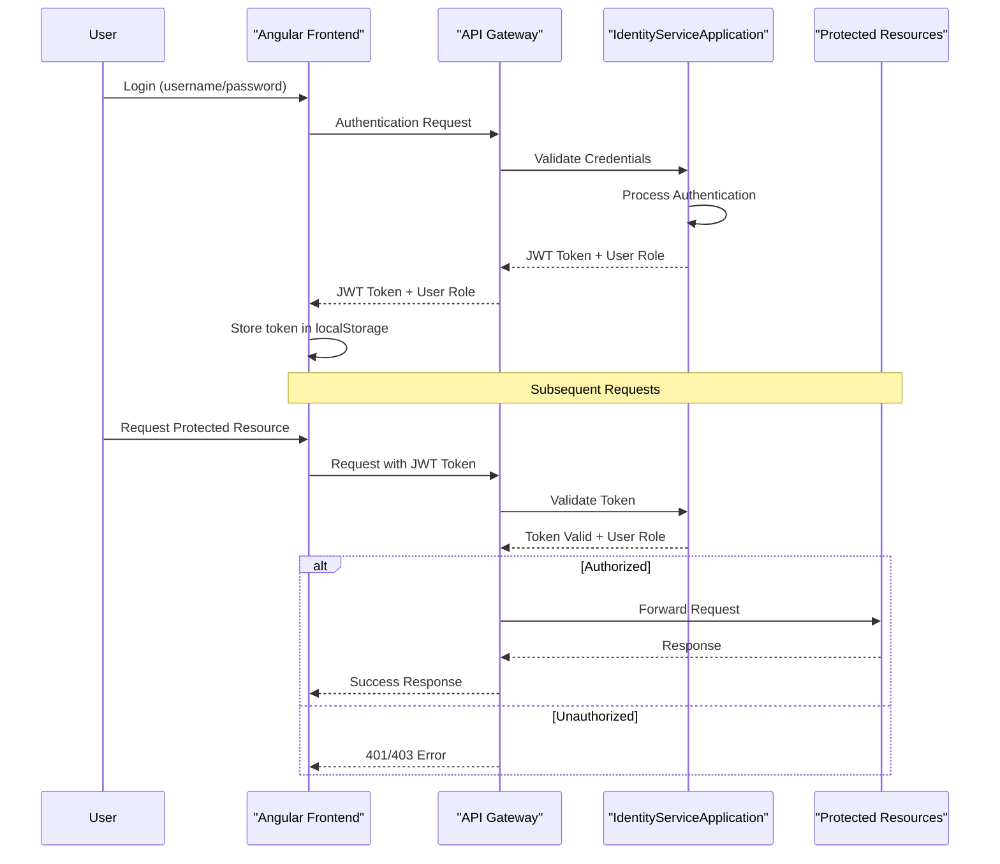

# Job Offers Management System

A comprehensive microservices-based application designed to facilitate job postings, applications, and related functionalities in an employment ecosystem.

## System Purpose and Scope

This system serves as a complete job marketplace with extended capabilities including:

- Job posting and application management
- User profile management (both companies and candidates)
- Room booking system for interviews or events
- Content management through articles
- Exchange programs management
- Payment processing capabilities


## User Roles and Navigation

The system implements role-based access control with three primary user roles:

| Role | Description | Primary Functions |
|------|-------------|------------------|
| VISITEUR | Regular job seekers/candidates | Create profile, view jobs, apply to jobs, manage articles |
| ADHERANT | Companies/organizations | Create company profile, post jobs, review applications, manage rooms |
| ADMIN | System administrators | Manage users, access all system functions | [1](#0-0) 

## Authentication and Authorization Flow



## Technical Implementation Details

### Microservices Communication

Each microservice is registered with the Eureka Discovery Server, which enables service discovery. The services can communicate with each other using Feign clients.

| Microservice | Main Purpose | Key Dependencies |
|--------------|--------------|------------------|
| Identity Service | User authentication and authorization | Eureka Client, Feign |
| Company Service | Company profile and job management | Eureka Client, Feign |
| Candidat Service | Candidate profile management | Eureka Client, Feign |
| Application Service | Job application processing | Eureka Client, Feign |
| Article Service | Content management | Eureka Client |
| Exchange Service | Exchange program management | Eureka Client, Feign |
| Booking Service | Room booking | Eureka Client |
| Availability Service | Room availability management | Eureka Client |
| Payment Service | Payment processing | Eureka Client |

### Frontend Design

The frontend application uses the Argon Dashboard Angular template, providing a responsive and modern user interface. The application is built with Angular and uses various UI components from the NgBootstrap and PrimeNG libraries. [2](#0-1) 

## Getting Started

### Prerequisites

- Java 11+
- Node.js and npm
- MySQL database
- Maven

### Installation

1. Clone the repository:
   ```
   git clone https://github.com/youssef994/job-offers-managment.git
   cd job-offers-managment
   ```

2. Start the backend services:
   ```
   cd backend-microservices
   
   # Start Discovery Server first
   cd discoveryserver
   mvn spring-boot:run
   
   # Start API Gateway
   cd ../api-gateway
   mvn spring-boot:run
   
   # Start other services
   # (Start each in a separate terminal)
   ```

3. Start the frontend application:
   ```
   cd microservice-frontApp
   npm install
   ng serve
   ```

4. Access the application at `http://localhost:4200`

## File Structure

The project is organized into two main directories:

- `backend-microservices/`: Contains all the Java Spring Boot microservices
- `microservice-frontApp/`: Contains the Angular frontend application


